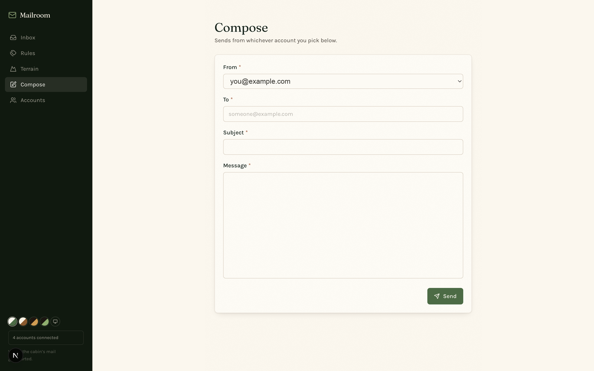

# Mailroom

> Where the cabin's mail gets sorted.

A local Gmail client built around triage rather than reading: several accounts in one inbox, rules that categorise mail as it arrives, and a view of where the volume is actually coming from.



## What it does

**One inbox, several accounts.** Connect multiple Gmail accounts and read them as a single stream, or filter to one.

**Rules** categorise messages by sender, subject or content, and the category filters across the top show live counts — so "Job Search (3)" is a button, not just a label.

**Terrain** breaks the inbox down by category volume, largest first, to show where the noise is really coming from.

**Compose and reply**, with attachments.

**Almanac hand-off.** A message can become a task or a calendar event in [Almanac](https://github.com/CamWhamBammus/almanac) — posted over plain HTTP to its public API, the same loose integration style the rest of the cabin uses.

## Credentials

Mailroom talks to Gmail through your own Google Cloud OAuth client. Copy `.env.example` to `.env.local` and fill in the values:

```
GOOGLE_CLIENT_ID=
GOOGLE_CLIENT_SECRET=
GOOGLE_REDIRECT_URI=http://localhost:3003/api/auth/callback
```

`.env.local` is gitignored, and OAuth tokens are stored outside the repo in `~/Library/Application Support/Mailroom/`. No credentials are in this repository.

## Stack

Next.js 16 (App Router) · React 19 · TypeScript · Tailwind 4 · Gmail API. No database — accounts and rules are JSON in the app support directory, and mail is always fetched live rather than mirrored locally.

## Running it

```bash
npm install
npm run dev
```

Then open <http://localhost:3003> and connect an account.

## The cabin

Part of a set of local-first apps launched from [The Lodge](https://github.com/CamWhamBammus/the-lodge).
